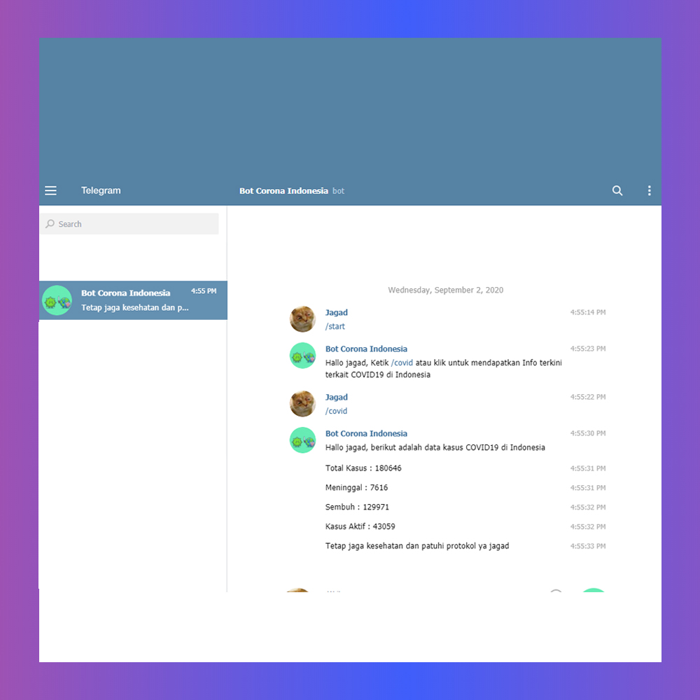

# BOT COVID-19 Telegram [Python]
This bot is used to monitor the Covid-10 outbreak in Indonesia. This code must be placed on the server because it must run 24 hours, you try this bot on @imyouruniverse_bot

## How to use
Installing requests
```
pip install requests
```
install urllib.request
```
pip install urllib.request
```
change token with your bot token
```
def telesend(bot_chatID, bot_message):
    url = "https://api.telegram.org/YOURTOKEN/sendMessage?chat_id=" + \
        bot_chatID + "&parse_mode=Markdown&text=" + bot_message
    requests.get(url)
    
while True:
        try:
            url = 'https://api.telegram.org/YOURTOKEN/getUpdates?offset=' + \
                str(offset[0])
            response = urllib.request.urlopen(url)
            data = json.loads(response.read())
```

Run bot to your server
'''
python3 main.py
'''


